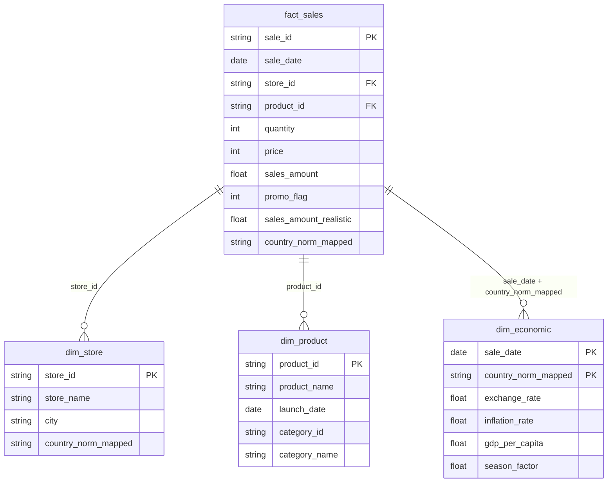

# 🍎 Apple Sales Dashboard — DAX Measures & Visual Documentation

> Complete reference for recreating the Streamlit dashboard in **Power BI** using DAX.

---

## Table of Contents

1. [Data Model & Relationships](#data-model--relationships)
2. [Calculated Columns](#calculated-columns)
3. [KPI Card Measures](#kpi-card-measures)
4. [Tab 1 — Sales Trends](#tab-1--sales-trends)
5. [Tab 2 — Market Analysis](#tab-2--market-analysis)
6. [Tab 3 — Product Insights](#tab-3--product-insights)
7. [Tab 4 — Store Performance](#tab-4--store-performance)
8. [Tab 5 — Economic Factors](#tab-5--economic-factors)
9. [Formatting & Conditional Logic](#formatting--conditional-logic)

---

## Data Model & Relationships

> [!IMPORTANT]
> The `dim_product` table has **duplicate `product_id`** rows (177 rows, 89 unique products). You must remove duplicates in Power Query before loading, or the relationships will fail.

### Power Query — Remove Duplicates in dim_product

```
// In Power Query Editor for dim_product:
// Home → Remove Rows → Remove Duplicates (on product_id column)
// Or using M code:
= Table.Distinct(Source, {"product_id"})
```

### Star Schema Relationships



| From Table | To Table | Key(s) | Cardinality | Cross-filter |
|---|---|---|---|---|
| `fact_sales` | `dim_store` | `store_id` | Many → One | Single |
| `fact_sales` | `dim_product` | `product_id` | Many → One | Single |
| `fact_sales` | `dim_economic` | `sale_date`, `country_norm_mapped` | Many → One | Single |

> [!WARNING]
> The `dim_economic` relationship uses a **composite key** (`sale_date` + `country_norm_mapped`). In Power BI, you'll need to create a composite key column in both tables or use a bridge table. See [Composite Key Workaround](#composite-key-workaround) below.

### Composite Key Workaround

Create a computed column in **both** `fact_sales` and `dim_economic`:

```dax
// In fact_sales table
EconomicKey = fact_sales[sale_date] & "|" & fact_sales[country_norm_mapped]

// In dim_economic table
EconomicKey = dim_economic[sale_date] & "|" & dim_economic[country_norm_mapped]
```

Then create the relationship on `EconomicKey` (Many-to-One, `fact_sales` → `dim_economic`).

---

## Calculated Columns

> [!NOTE]
> These columns replicate the derived fields created in the Python `load_data()` function.

### In fact_sales or a Date Table

```dax
// Year
Year = YEAR(fact_sales[sale_date])

// Month Number
MonthNum = MONTH(fact_sales[sale_date])

// Month Name (abbreviated)
MonthName = FORMAT(fact_sales[sale_date], "MMM")

// Year-Month (for time series axis)
YearMonth = FORMAT(fact_sales[sale_date], "YYYY-MM")

// Quarter Label
Quarter = "Q" & FORMAT(fact_sales[sale_date], "Q")

// Year-Quarter (for quarterly grouping)
YearQuarter = 
    YEAR(fact_sales[sale_date]) & " Q" & FORMAT(fact_sales[sale_date], "Q")

// Country (Title Case) — if needed as a display column
Country = 
    UPPER(LEFT(fact_sales[country_norm_mapped], 1)) & 
    MID(fact_sales[country_norm_mapped], 2, LEN(fact_sales[country_norm_mapped]))

// Promo Label
PromoLabel = IF(fact_sales[promo_flag] = 1, "Promo", "No Promo")
```

> [!TIP]
> For the `Country` title-case conversion, it's cleaner to handle this in **Power Query** using `Text.Proper()`:
> ```
> = Table.TransformColumns(Source, {{"country_norm_mapped", Text.Proper, type text}})
> ```

---

## KPI Card Measures

These 6 measures power the top-row KPI cards. All respond to slicer filters.

### KPI 1 — Total Revenue

```dax
Total Revenue = 
    SUM(fact_sales[sales_amount_realistic])
```

**Format string**: `$#,##0.00,,M` (for millions) or use the dynamic format below:

```dax
Total Revenue Formatted = 
    VAR _val = [Total Revenue]
    RETURN
        IF(
            _val >= 1E9,
            FORMAT(_val / 1E9, "$#,##0.00") & "B",
            IF(
                _val >= 1E6,
                FORMAT(_val / 1E6, "$#,##0.00") & "M",
                FORMAT(_val, "$#,##0")
            )
        )
```

| Property | Value |
|---|---|
| **Unfiltered Result** | $6,937,267,929.42 (~$6.94B) |
| **Card Subtitle** | "Realistic adj. sales" |

---

### KPI 2 — Total Units Sold

```dax
Total Units Sold = 
    SUM(fact_sales[quantity])
```

| Property | Value |
|---|---|
| **Format** | `#,##0` |
| **Unfiltered Result** | 5,721,344 |
| **Card Subtitle** | "Across all products" |

---

### KPI 3 — Total Transactions

```dax
Total Transactions = 
    COUNTROWS(fact_sales)
```

| Property | Value |
|---|---|
| **Format** | `#,##0` |
| **Unfiltered Result** | 1,040,200 |
| **Card Subtitle** | "Filtered records" |

---

### KPI 4 — Avg Order Value (AOV)

```dax
Avg Order Value = 
    AVERAGE(fact_sales[sales_amount_realistic])
```

| Property | Value |
|---|---|
| **Format** | `$#,##0` |
| **Unfiltered Result** | $6,669 |
| **Card Subtitle** | "Per transaction" |

---

### KPI 5 — Promo Rate

```dax
Promo Rate = 
    DIVIDE(
        COUNTROWS(FILTER(fact_sales, fact_sales[promo_flag] = 1)),
        COUNTROWS(fact_sales),
        0
    )
```

Or equivalently:

```dax
Promo Rate = 
    AVERAGE(fact_sales[promo_flag])
```

| Property | Value |
|---|---|
| **Format** | `0.0%` |
| **Unfiltered Result** | 10.0% |
| **Card Subtitle** | "Transactions on promo" |

---

### KPI 6 — Active Markets

```dax
Active Markets = 
    DISTINCTCOUNT(fact_sales[country_norm_mapped])
```

| Property | Value |
|---|---|
| **Format** | `0` |
| **Unfiltered Result** | 19 |
| **Card Subtitle** | "Countries represented" |

---

## Tab 1 — Sales Trends

### 1.1 Sales Revenue Trend (Area Chart)

> Line/Area chart showing revenue over time at configurable granularity.

**Measure** (same for all granularities):
```dax
Revenue = SUM(fact_sales[sales_amount_realistic])
```

| Granularity | Axis Field | Visual Type |
|---|---|---|
| Monthly | `YearMonth` | Area Chart |
| Quarterly | `YearQuarter` | Area Chart |
| Yearly | `Year` | Area Chart |

> [!TIP]
> In Power BI, use a **bookmark + button** or **field parameter** to switch granularity, rather than separate visuals.

**Field Parameter for Granularity** (Power BI Desktop → Modeling → New Parameter → Fields):
```dax
Time Granularity = {
    ("Monthly", NAMEOF(fact_sales[YearMonth]), 0),
    ("Quarterly", NAMEOF(fact_sales[YearQuarter]), 1),
    ("Yearly", NAMEOF(fact_sales[Year]), 2)
}
```

---

### 1.2 Revenue by Category & Year (Grouped Bar)

**Visual**: Clustered Bar Chart

| Property | Field |
|---|---|
| **Axis** | `Year` (from fact_sales or date table) |
| **Legend** | `dim_product[category_name]` |
| **Values** | `[Total Revenue]` measure |

```dax
// Already defined above
Total Revenue = SUM(fact_sales[sales_amount_realistic])
```

---

### 1.3 Avg Monthly Revenue — Seasonality (Bar Chart)

> [!IMPORTANT]
> This chart shows the **average total monthly revenue across years**, NOT the average per transaction. This was a bug in the original dashboard that was fixed.

```dax
Avg Monthly Revenue = 
    DIVIDE(
        SUM(fact_sales[sales_amount_realistic]),
        DISTINCTCOUNT(fact_sales[Year]),
        0
    )
```

| Property | Field |
|---|---|
| **Axis** | `MonthName` (sorted by `MonthNum`) |
| **Values** | `[Avg Monthly Revenue]` |
| **Format** | `$#,##0` |

> [!TIP]
> Ensure `MonthName` is sorted by `MonthNum` in Power BI:
> Select `MonthName` column → Column Tools → Sort by Column → `MonthNum`

---

### 1.4 Promo vs Non-Promo Revenue Over Time (Line Chart)

**Visual**: Line Chart with two series

| Property | Field |
|---|---|
| **Axis** | `YearMonth` |
| **Legend** | `PromoLabel` (or `promo_flag`) |
| **Values** | `[Total Revenue]` |

Or use dedicated measures for each:

```dax
Revenue Promo = 
    CALCULATE(
        SUM(fact_sales[sales_amount_realistic]),
        fact_sales[promo_flag] = 1
    )

Revenue No Promo = 
    CALCULATE(
        SUM(fact_sales[sales_amount_realistic]),
        fact_sales[promo_flag] = 0
    )
```

---

## Tab 2 — Market Analysis

### 2.1 Total Revenue by Country (Horizontal Bar)

| Property | Field |
|---|---|
| **Y-Axis** | `Country` (title-cased `country_norm_mapped`) |
| **X-Axis** | `[Total Revenue]` |
| **Sort** | Descending by `[Total Revenue]` |

```dax
// Already defined
Total Revenue = SUM(fact_sales[sales_amount_realistic])
```

---

### 2.2 Market Share Treemap

| Property | Field |
|---|---|
| **Category** | `Country` |
| **Values** | `[Total Revenue]` |

No additional measure needed. Optionally add a share percentage:

```dax
Revenue Share % = 
    DIVIDE(
        [Total Revenue],
        CALCULATE([Total Revenue], ALL(fact_sales[country_norm_mapped])),
        0
    )
```

---

### 2.3 Top-10 Country Revenue Trend (Line Chart)

**Visual**: Line Chart with markers

| Property | Field |
|---|---|
| **Axis** | `Year` |
| **Legend** | `Country` |
| **Values** | `[Total Revenue]` |
| **Filter** | Top N = 10, by `[Total Revenue]` |

Apply a **Top N filter** on the `Country` field:
- Filter type: Top N
- Show items: Top 10
- By value: `[Total Revenue]`

---

### 2.4 Units Sold by Country (Bar Chart)

| Property | Field |
|---|---|
| **Axis** | `Country` |
| **Values** | `[Total Units Sold]` |
| **Filter** | Top 15 |

```dax
// Already defined
Total Units Sold = SUM(fact_sales[quantity])
```

---

### 2.5 Avg Order Value by Country (Bar Chart)

| Property | Field |
|---|---|
| **Axis** | `Country` |
| **Values** | `[Avg Order Value]` |
| **Filter** | Top 15, sorted descending |

```dax
// Already defined
Avg Order Value = AVERAGE(fact_sales[sales_amount_realistic])
```

---

## Tab 3 — Product Insights

### 3.1 Revenue Share by Category (Donut Chart)

| Property | Field |
|---|---|
| **Legend** | `dim_product[category_name]` |
| **Values** | `[Total Revenue]` |
| **Inner Radius** | ~45% (donut style) |

---

### 3.2 Units Sold by Category (Bar Chart)

| Property | Field |
|---|---|
| **Axis** | `dim_product[category_name]` |
| **Values** | `[Total Units Sold]` |

---

### 3.3 Top N Products by Revenue (Horizontal Bar)

| Property | Field |
|---|---|
| **Y-Axis** | `dim_product[product_name]` |
| **X-Axis** | `[Total Revenue]` |
| **Legend** | `dim_product[category_name]` |
| **Filter** | Top N (user-configurable via "What If" parameter) |

**What-If Parameter for Top N**:

```dax
// Create via Modeling → New Parameter → "What if"
// Name: TopN Products
// Min: 5, Max: 30, Default: 15, Increment: 1
TopN Products Value = SELECTEDVALUE('TopN Products'[TopN Products], 15)
```

Then apply a **Top N visual-level filter** on `product_name` using `[Total Revenue]` with the parameter value.

---

### 3.4 Price Distribution by Category (Box Plot)

> [!NOTE]
> Power BI doesn't have a native box plot. Use a **custom visual** from AppSource (e.g., "Box and Whisker chart") or approximate with a table.

**With Custom Visual (Box & Whisker)**:

| Property | Field |
|---|---|
| **Category** | `dim_product[category_name]` |
| **Sampling** | `fact_sales[price]` |

**Alternative — Summary Table with measures**:

```dax
Price Median = MEDIAN(fact_sales[price])

Price P25 = PERCENTILE.INC(fact_sales[price], 0.25)

Price P75 = PERCENTILE.INC(fact_sales[price], 0.75)

Price Min = MIN(fact_sales[price])

Price Max = MAX(fact_sales[price])
```

---

### 3.5 Quantity Distribution (Histogram)

> [!NOTE]
> Power BI doesn't have a native histogram. Use a **custom visual** (e.g., "Histogram Chart") or bin the data manually.

**Bin approach**:

```dax
// Create a calculated column for quantity bins
Quantity Bin = 
    SWITCH(
        TRUE(),
        fact_sales[quantity] <= 2, "1-2",
        fact_sales[quantity] <= 4, "3-4",
        fact_sales[quantity] <= 6, "5-6",
        fact_sales[quantity] <= 8, "7-8",
        "9-10"
    )
```

Then use a **Bar Chart** with `Quantity Bin` on axis and `COUNTROWS` as value:

```dax
Transaction Count = COUNTROWS(fact_sales)
```

---

### 3.6 Promo Impact by Category (Grouped Bar)

Shows average transaction value split by promo vs non-promo per category.

| Property | Field |
|---|---|
| **Axis** | `dim_product[category_name]` |
| **Legend** | `PromoLabel` |
| **Values** | `[Avg Order Value]` |

Or dedicated measures:

```dax
Avg Transaction Value Promo = 
    CALCULATE(
        AVERAGE(fact_sales[sales_amount_realistic]),
        fact_sales[promo_flag] = 1
    )

Avg Transaction Value No Promo = 
    CALCULATE(
        AVERAGE(fact_sales[sales_amount_realistic]),
        fact_sales[promo_flag] = 0
    )
```

---

## Tab 4 — Store Performance

### 4.1 Top 20 Stores by Revenue (Horizontal Bar)

| Property | Field |
|---|---|
| **Y-Axis** | `dim_store[store_name]` |
| **X-Axis** | `[Total Revenue]` |
| **Legend** | `dim_store[country_norm_mapped]` (title-cased) |
| **Filter** | Top 20 by `[Total Revenue]` |

---

### 4.2 Store Count by Country (Bar Chart)

> [!NOTE]
> This uses `dim_store` directly and is **not affected by fact_sales filters/slicers**. Use `ALLEXCEPT` or a disconnected table to prevent slicer interaction.

```dax
Store Count = 
    CALCULATE(
        COUNTROWS(dim_store),
        ALL(fact_sales)
    )
```

Or if you want it fully independent from all slicers:

```dax
Store Count All = 
    CALCULATE(
        COUNTROWS(dim_store),
        REMOVEFILTERS()
    )
```

| Property | Field |
|---|---|
| **Axis** | `dim_store[country_norm_mapped]` |
| **Values** | `[Store Count]` |

---

### 4.3 Revenue per Store by Country (Bar Chart)

```dax
Revenue Per Store = 
    DIVIDE(
        [Total Revenue],
        DISTINCTCOUNT(fact_sales[store_id]),
        0
    )
```

| Property | Field |
|---|---|
| **Axis** | `Country` |
| **Values** | `[Revenue Per Store]` |
| **Sort** | Descending |

---

### 4.4 Store Revenue Heatmap — Top 20 Stores × Year (Matrix)

> Power BI equivalent: **Matrix visual** with conditional formatting.

| Property | Field |
|---|---|
| **Rows** | `dim_store[store_name]` |
| **Columns** | `Year` |
| **Values** | `[Total Revenue]` |
| **Filter** | Top 20 stores by `[Total Revenue]` |
| **Conditional Formatting** | Background color scale (White → Purple) on values |

Setup conditional formatting:
1. Click the dropdown on `[Total Revenue]` in Values → Conditional formatting → Background color
2. Format style: Gradient
3. Minimum color: White, Maximum color: Purple
4. Based on: `[Total Revenue]`

---

## Tab 5 — Economic Factors

> [!IMPORTANT]
> Economic measures use the `dim_economic` table. Since this is a dimension with a composite key, measures should reference `dim_economic` directly using `CALCULATE` with `ALL(fact_sales)` if you want values independent of sales filters, or leave as-is if you want them to filter with sales context.

### 5.1 Avg GDP per Capita by Country (Bar Chart)

```dax
Avg GDP Per Capita = 
    AVERAGE(dim_economic[gdp_per_capita])
```

| Property | Field |
|---|---|
| **Axis** | `dim_economic[country_norm_mapped]` |
| **Values** | `[Avg GDP Per Capita]` |
| **Sort** | Descending |
| **Format** | `$#,##0` |

---

### 5.2 Avg Inflation Rate by Country (Bar Chart)

```dax
Avg Inflation Rate = 
    AVERAGE(dim_economic[inflation_rate])
```

| Property | Field |
|---|---|
| **Axis** | `dim_economic[country_norm_mapped]` |
| **Values** | `[Avg Inflation Rate]` |
| **Sort** | Descending |
| **Format** | `0.00%` or `0.00` with "%" suffix |

---

### 5.3 GDP vs Sales Revenue Correlation (Scatter)

```dax
// X-Axis
Avg GDP Per Capita = AVERAGE(dim_economic[gdp_per_capita])

// Y-Axis
Total Revenue = SUM(fact_sales[sales_amount_realistic])
```

| Property | Field |
|---|---|
| **Details** | `Country` (one bubble per country) |
| **X-Axis** | `[Avg GDP Per Capita]` |
| **Y-Axis** | `[Total Revenue]` |
| **Size** | `[Total Revenue]` |
| **Legend** | `Country` |

---

### 5.4 Exchange Rate Over Time (Line Chart)

| Property | Field |
|---|---|
| **Axis** | `dim_economic[sale_date]` |
| **Legend** | `dim_economic[country_norm_mapped]` |
| **Values** | Exchange Rate measure or column |

```dax
Exchange Rate = 
    AVERAGE(dim_economic[exchange_rate])
```

> [!TIP]
> Add a slicer for `dim_economic[country_norm_mapped]` with default selections: Japan, United Kingdom, Australia, Canada. Use slicer sync to scope it to this visual only.

---

### 5.5 Inflation Rate Over Time (Line Chart)

| Property | Field |
|---|---|
| **Axis** | `dim_economic[sale_date]` |
| **Legend** | `dim_economic[country_norm_mapped]` |
| **Values** | `[Avg Inflation Rate]` |

Uses the same country slicer as visual 5.4.

---

### 5.6 Season Factor Distribution (Histogram)

**Bin approach**:

```dax
// Calculated column in dim_economic
Season Factor Bin = 
    ROUND(dim_economic[season_factor], 1)
```

Then use a Bar Chart:

| Property | Field |
|---|---|
| **Axis** | `Season Factor Bin` |
| **Values** | `COUNTROWS(dim_economic)` |

```dax
Economic Record Count = COUNTROWS(dim_economic)
```

---

## Formatting & Conditional Logic

### Dynamic Revenue Format (for Card visuals)

```dax
Revenue Display = 
    VAR _val = [Total Revenue]
    RETURN
        SWITCH(
            TRUE(),
            _val >= 1E9, FORMAT(_val / 1E9, "$#,0.00") & "B",
            _val >= 1E6, FORMAT(_val / 1E6, "$#,0.00") & "M",
            FORMAT(_val, "$#,##0")
        )
```

### Month Sort Order

If using `MonthName` as a text column, ensure proper calendar sort:

```dax
MonthSortOrder = MONTH(fact_sales[sale_date])
```

Then in Power BI: Select `MonthName` → Column Tools → **Sort by Column** → `MonthSortOrder`.

---

## Complete Measures Summary

| # | Measure Name | DAX Formula | Used In |
|---|---|---|---|
| 1 | `Total Revenue` | `SUM(fact_sales[sales_amount_realistic])` | KPI 1, Tabs 1-4 |
| 2 | `Total Units Sold` | `SUM(fact_sales[quantity])` | KPI 2, Tabs 2-3 |
| 3 | `Total Transactions` | `COUNTROWS(fact_sales)` | KPI 3 |
| 4 | `Avg Order Value` | `AVERAGE(fact_sales[sales_amount_realistic])` | KPI 4, Tabs 2-3 |
| 5 | `Promo Rate` | `AVERAGE(fact_sales[promo_flag])` | KPI 5 |
| 6 | `Active Markets` | `DISTINCTCOUNT(fact_sales[country_norm_mapped])` | KPI 6 |
| 7 | `Avg Monthly Revenue` | `DIVIDE(SUM(...), DISTINCTCOUNT(Year))` | Tab 1 Seasonality |
| 8 | `Revenue Promo` | `CALCULATE(SUM(...), promo_flag=1)` | Tab 1 |
| 9 | `Revenue No Promo` | `CALCULATE(SUM(...), promo_flag=0)` | Tab 1 |
| 10 | `Revenue Share %` | `DIVIDE([Total Revenue], CALCULATE(..., ALL(...)))` | Tab 2 |
| 11 | `Revenue Per Store` | `DIVIDE([Total Revenue], DISTINCTCOUNT(store_id))` | Tab 4 |
| 12 | `Store Count` | `CALCULATE(COUNTROWS(dim_store), ALL(fact_sales))` | Tab 4 |
| 13 | `Avg GDP Per Capita` | `AVERAGE(dim_economic[gdp_per_capita])` | Tab 5 |
| 14 | `Avg Inflation Rate` | `AVERAGE(dim_economic[inflation_rate])` | Tab 5 |
| 15 | `Exchange Rate` | `AVERAGE(dim_economic[exchange_rate])` | Tab 5 |
| 16 | `Total Revenue Formatted` | Dynamic format (B/M/K) | KPI Card display |
| 17 | `Avg Txn Value Promo` | `CALCULATE(AVERAGE(...), promo_flag=1)` | Tab 3 |
| 18 | `Avg Txn Value No Promo` | `CALCULATE(AVERAGE(...), promo_flag=0)` | Tab 3 |

---

> [!NOTE]
> **Slicer Setup**: Create 4 slicers matching the Streamlit sidebar filters:
> - `Year` (multi-select dropdown)
> - `Country` (multi-select dropdown, title-cased)
> - `dim_product[category_name]` (multi-select dropdown)
> - `PromoLabel` (single-select radio: All / Promo / No Promo)
> 
> Sync all slicers across all report pages/tabs.
